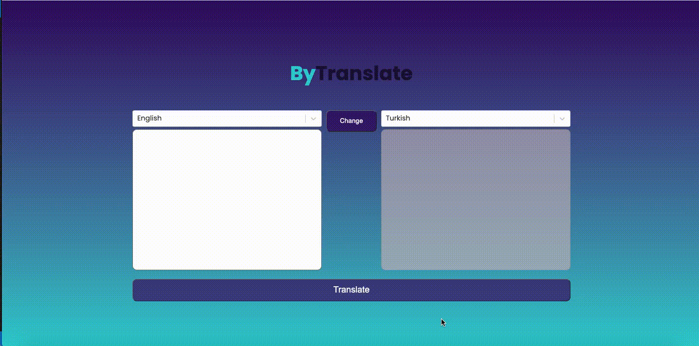
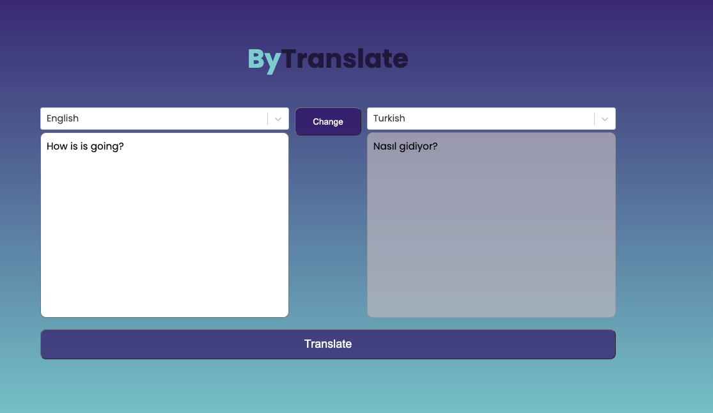
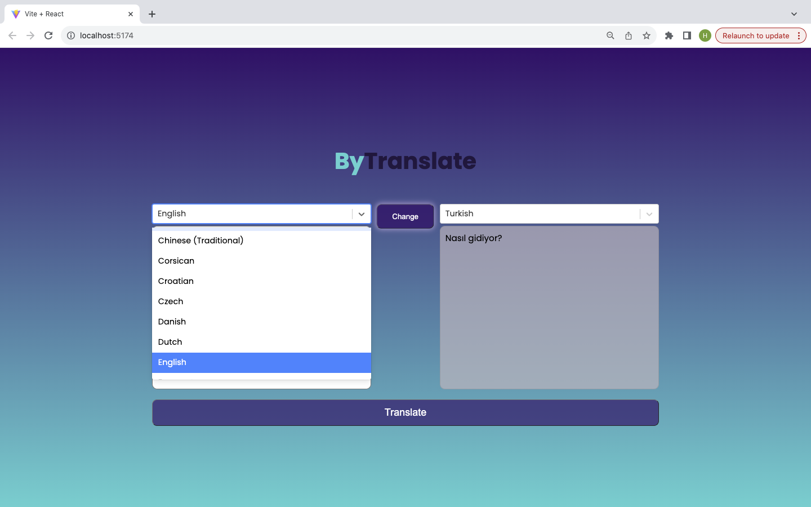
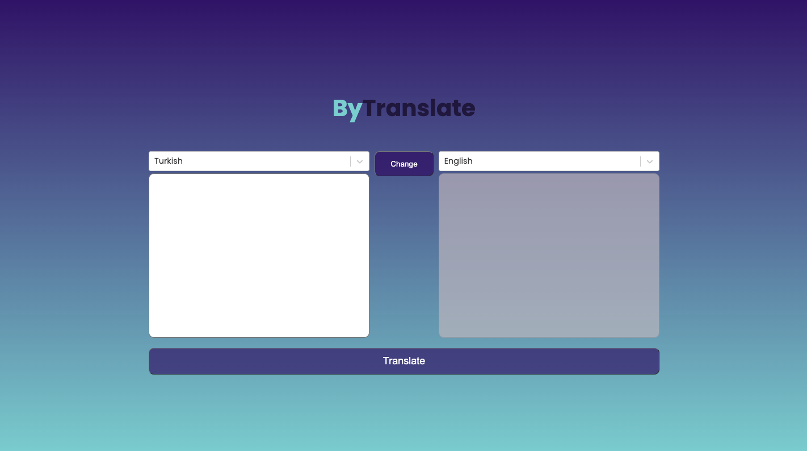
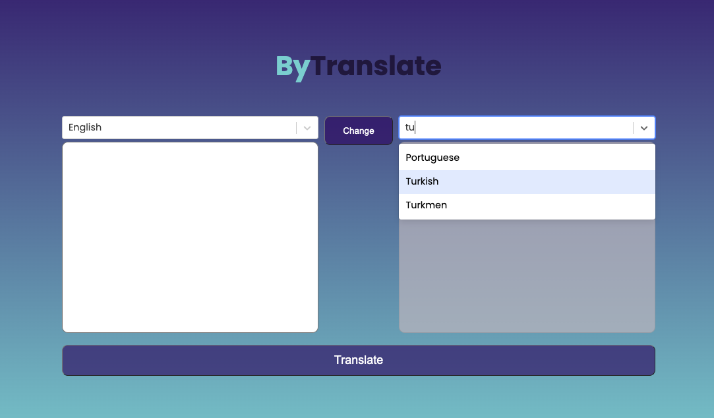

`````
###Libraries used:
`````

#react-redux

#@reduxjs/toolkit

#axios

#react-dom

#react-select

#sass

##React-Router-DOM: #Purpose: React-Router-DOM is a routing library for React. It enables navigation and URL handling within a React application.

##Sass (Syntactically Awesome Stylesheets): #Purpose: Sass is a CSS preprocessor that extends CSS with features like variables, nesting, and mixins, making styling more efficient and maintainable.

##Axios: #Purpose: Axios is a popular JavaScript library used for making HTTP requests from browsers or Node.js. It works with Promises and provides an easy-to-use API.

##@Reduxjs/Toolkit: #Purpose: Redux Toolkit is an official package that simplifies working with Redux, a state management library for JavaScript applications. #Key Features: Provides utilities and functions to reduce the amount of boilerplate code needed for Redux, like creating slices, configuring the store, and managing actions and reducers.

##React-Redux: #Purpose: React-Redux is the official binding for React and Redux, allowing React components to interact with the Redux store. #Key Features: Connects React components to the Redux store, enabling the components to subscribe to store updates and dispatch actions.


##SCREEN GIF



##SCREEN VIEW









